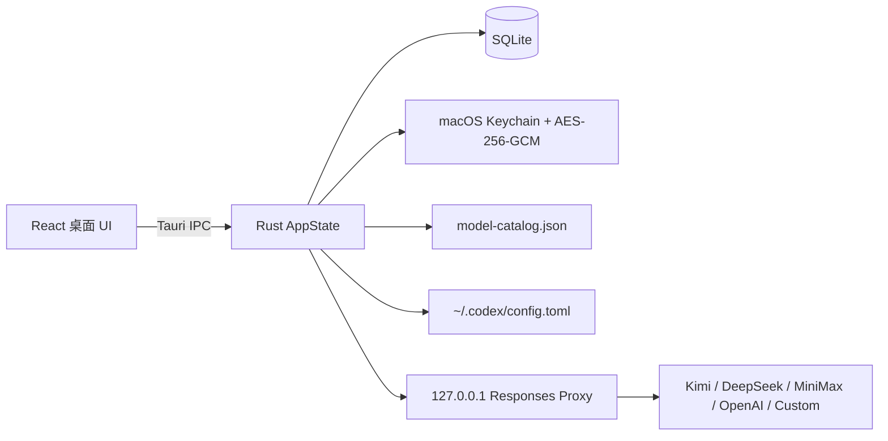

# Codex Spur — 实现说明

> 当前实现是 macOS-first 的 Tauri 2 桌面端首轮可运行版本。它不修改、不注入 `ChatGPT.app`，而是通过 Codex 的 provider + `model_catalog_json` seam，把本地代理发布的模型接入 Codex 右下角模型选择器。

## 已实现路径



### 产品对象：供应商实例（CC Switch 风格）

- **主对象是供应商实例**，不是「账号池产品」。同一 `kind` 可无限添加（多个 OpenAI、多个 Kimi…）。
- 概览列表只展示用户创建的实例；空安装无固定 OpenAI/Kimi 占位行。
- **添加供应商**向导先选类型与方式，再「保存并拉取模型」，立刻在主列表多一行。
- OpenAI 入口：
  1. **OpenAI · 官方订阅** — 浏览器 localhost PKCE（与原生 Codex / Codex Tools 一致）：打开 `auth.openai.com/oauth/authorize`，授权后自动回调 `http://localhost:{port}/auth/callback`，Rust 侧换 token、入库并拉官方模型（带 `client_version`）。token **不经过前端**。Device Code 仍保留为内部后备 API。
  2. **OpenAI · API Key** — `api.openai.com` 密钥
  3. **OpenAI · 导入账号** — 多账号凭据 JSON → 写入该实例加密凭据，再拉模型
  4. **OpenAI · 导入配置 JSON** — 供应商配置（`base_url` / 别名 / 嵌套 env）；账号 JSON 会明确拒绝
- **Kimi Code**：默认 `https://api.kimi.com/coding/v1`，只需 API Key
- 其它 kind：API 配置；自定义可导入配置 JSON
- 编辑实例：连接信息、再拉取、账号摘要/继续导入；无一级「账号池」页签。
- 拉取结果只进入候选列表，不自动发布。模型页逐个启用后才进入 catalog / Codex 右下角。
- 每个模型都有 `none / minimal / low / medium / high / xhigh / max / ultra` 八档映射。

### 凭据与运行时调度（内部）

- 每个供应商实例有默认内部 pool（实现细节）；`active_pool_id` 供运行时使用。
- 多账号实例支持 **Pool | Fixed** 路由；Pool 为 Sub2API 风格独立实现（不拷贝 LGPL 源码）。
- 「导入账号」只是创建多账号 OpenAI 实例的一种方式；UI 用语优先「账号 / 多账号」，不做一级账号池导航。
- JSON 根对象、数组、`accounts` 数组、Codex `auth.json`、Sub2API 风格 tokens 均可解析（仅走账号导入路径）。
- 原始 secret 不回传前端；SQLite 只保存 AES-256-GCM 密文，主密钥位于 macOS Keychain。
- **调度流水线**（`scheduler` 模块，Sub2API 可观察契约的独立实现）：
  1. Fixed 模式 → 固定账号；
  2. 否则 `previous_response_id` sticky（命中后把 session 也绑到同账号，利于 prompt cache）；
  3. 否则 session-hash sticky（`session_id` / `conversation_id` / `prompt_cache_key` / 内容种子 fallback）；
  4. sticky 账号仅并发满时优先**等待槽位**（默认 30s），超时再 escape；
  5. 否则负载感知 Top-K（默认 K=7）；候选 min-max 归一化打分后，按 `(score−min)+1 × member_weight` 抽签。
- 打分因子：priority / load / queue / error_rate / ttft / reset / quota_headroom（默认 `quota_headroom=1`）。
- **额度接入**：候选水合缓存的 5h/7d 快照；新鲜快照 remaining≈0 硬过滤；可选 auto-pause 阈值；`quota_remaining` 参与 headroom / prefer_soonest_reset；快照 &gt;8h 视为中性。
- sticky 表与 lease 分离；请求结束释放 lease；sticky 仅在冷却/鉴权/额度尽/错误率·TTFT 劣化时 escape（健康账号不因「更闲」而换号）。
- **换号 / 冷却**：401 → `auth_invalid`；402/403 → entitlement；429/usage_limit → 解析 `x-codex-*` / body `resets_at` / `Retry-After` 写入**绝对** cooldown（可至数小时），同请求 exclude 后重选；5xx/传输错误也可换号。最后一次 attempt 同样落库冷却。
- **日常 UI**（供应商编辑）：Pool|Fixed、账号 weight/priority/concurrency/参与。
- **高级 UI**（设置 → 调度）：Top-K、sticky TTL、score weights、escape、429、lease。
- **诊断**：`proxy_request_events` 记录 selection layer、指纹、结果、换号与冷却（脱敏）；诊断页 split 列表 + 详情。
- “发送 Hi”会使用用户选择的可用模型测试账号；失败会落库并在 UI 显示失效。

### Codex 应用

- 应用前生成 inspector 预览。
- 为兼容已有配置，继续写入稳定技术路径 `~/.codex/codex-select/model-catalog.json`。
- 用 `toml_edit` 保留其它 TOML 配置，并只更新 `codex_select` provider。
- 应用前备份 `config.toml`；支持恢复最近备份。
- provider 使用本地代理的随机 bearer token，前端不会读取该 token。
- 关闭窗口只隐藏；菜单栏 Tray 仍保留代理，只有退出应用才终止进程。

### Desktop 可见性（防「只显示官方模型」）

对齐 Nice Switch「切换第三方时保留官方登录」：

| 登录 | 位置 | 用途 |
|---|---|---|
| **ChatGPT Desktop 官方登录** | `~/.codex/auth.json` | GUI 身份门控，决定能否显示 Kimi/DeepSeek |
| **Spur 供应商凭据** | Spur vault | 代理上游鉴权；**不能**替代 Desktop 门控 |

Apply 硬约束：

1. 始终写入 `name = "OpenAI"` + `requires_openai_auth = true` + `supports_websockets = false` + 本地 `experimental_bearer_token`。
2. catalog 含非官方 slug（`spur-route-*` 等）时，若无有效 `auth.json` → **硬拦截 Apply**（不写假 token）。
3. 概览页「Desktop 可见性」清单 + `desktopVisibility` 字段：auth / 门控 / catalog / 代理 / 冷启动 / CC Switch。
4. 刷新时重新探测，防止 token 失效或被 CC Switch 抢回后仍显示「健康」。
5. GUI 选模型：Power 滑动条主要是官方 gpt-5.6-*；完整列表在 **高级 → 模型**。

### OpenAI 额度

- 支持 `/backend-api/wham/usage`、`/api/codex/usage` 候选路径。
- 解析 5 小时、7 天额度和重置时间。
- 支持 `/backend-api/wham/rate-limit-reset-credits` 查询重置卡。
- 消耗重置卡要求用户确认、稳定 UUID 幂等键、数据库审计；超时/响应不确定时禁止换新键自动重试。

## 重要限制

1. DeepSeek Chat Completions 已有非流式 Responses 转换；流式 SSE、复杂 tool call、Anthropic Messages 转换仍会明确返回未实现错误，不会伪装成功。
2. ChatGPT 官方订阅 access_token 会在代理取号前按 JWT `exp` 做 refresh_token 续期；ChatGPT Web session 的完整续期、CPA/Sub2API/Cockpit Tools 的每种特有字段还需要逐一接入。
3. OpenAI 官方模型 catalog 当前使用统一 Codex Spur route metadata；官方返回的高级工具/可见性字段尚未全部映射到本地 `CatalogModel`。
4. Base URL 发现结果是供应商实时返回的事实，不在应用中硬编码模型名称；API key 在发现时会写入本地加密凭据。

## 验证命令

```bash
npm run typecheck
npm run lint
npm run test
npm run build
cargo check --manifest-path src-tauri/Cargo.toml
cargo test --manifest-path src-tauri/Cargo.toml
cargo clippy --manifest-path src-tauri/Cargo.toml --all-targets --all-features -- -D warnings
npm run tauri build
```

## 为什么 `DESIGN.md` 仍然有用，但不能直接照搬网页设计

`DESIGN.md` 对桌面端仍然有用的部分是：信息层级、密度、颜色语义、状态可见性、窄窗口下 inspector 的转化方式、错误与警告的文本化表达。

不应直接照搬的部分是：网页的横向营销布局、滚动叙事、依赖 hover 的交互和对网络首屏的假设。桌面端需要菜单栏常驻、窗口关闭语义、键盘/鼠标优先、可恢复配置、长生命周期连接和可中断任务。因此本实现把 Apple Design 用在“立即反馈、可预测、可中断、reduced motion、少量层级动画”上，把 Cohere 视觉稿只当作 token 参考。
