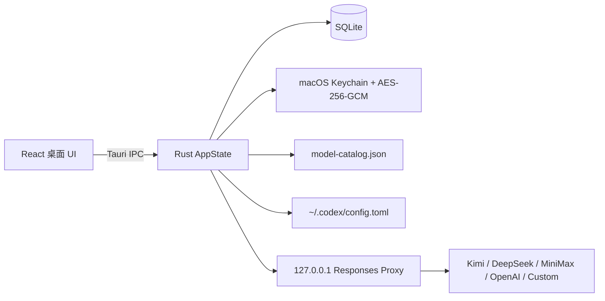

# Codex Spur — 实现说明

> 当前实现是 macOS-first 的 Tauri 2 桌面端首轮可运行版本。它不修改、不注入 `ChatGPT.app`，而是通过 Codex 的 provider + `model_catalog_json` seam，把本地代理发布的模型接入 Codex 右下角模型选择器。

## 已实现路径



### 模型发现与选择

- 供应商页通过 Base URL 拉取 OpenAI-compatible `/models`。
- OpenAI 官方订阅在 Base URL 留空时使用已导入账号访问 `https://chatgpt.com/backend-api/codex/models`。
- 拉取结果只进入候选列表，不自动发布。
- 模型页逐个启用/停用；启用模型才会进入运行时 catalog 和 Codex 右下角列表。
- 每个模型都有 `none / minimal / low / medium / high / xhigh / max / ultra` 八档映射；重复映射也完整展示，避免用户误解档位缺失。

### 账号池

- JSON 根对象、数组、`accounts` 数组、Codex `auth.json`、Sub2API 风格 tokens 均可解析。
- 原始 secret 不回传前端；SQLite 只保存 AES-256-GCM 密文，主密钥位于 macOS Keychain。
- 每个供应商自动建立默认账号池；池使用 least-active + sticky affinity。
- Codex session id / previous response id / prompt cache key 会被做不可逆 SHA-256 affinity fingerprint。
- 账号上游返回 401/403 时标记失效并在同一请求内最多换号 3 次；429 也会触发换号，但不会把账号标记为失效。
- “发送 Hi”会使用用户选择的可用模型测试账号；失败会落库并在 UI 显示失效。

### Codex 应用

- 应用前生成 inspector 预览。
- 为兼容已有配置，继续写入稳定技术路径 `~/.codex/codex-select/model-catalog.json`。
- 用 `toml_edit` 保留其它 TOML 配置，并只更新 `codex_select` provider。
- 应用前备份 `config.toml`；支持恢复最近备份。
- provider 使用本地代理的随机 bearer token，前端不会读取该 token。
- 关闭窗口只隐藏；菜单栏 Tray 仍保留代理，只有退出应用才终止进程。

### OpenAI 额度

- 支持 `/backend-api/wham/usage`、`/api/codex/usage` 候选路径。
- 解析 5 小时、7 天额度和重置时间。
- 支持 `/backend-api/wham/rate-limit-reset-credits` 查询重置卡。
- 消耗重置卡要求用户确认、稳定 UUID 幂等键、数据库审计；超时/响应不确定时禁止换新键自动重试。

## 重要限制

1. DeepSeek Chat Completions 已有非流式 Responses 转换；流式 SSE、复杂 tool call、Anthropic Messages 转换仍会明确返回未实现错误，不会伪装成功。
2. OAuth refresh token 的真实刷新流程、ChatGPT Web session 的完整续期策略、CPA/Sub2API/Cockpit Tools 的每种特有字段还需要逐一接入；当前先完成安全归一化、加密、粘性调度和存活测试。
3. OpenAI 官方模型 catalog 当前使用统一 Codex Spur route metadata；官方返回的高级工具/可见性字段尚未全部映射到本地 `CatalogModel`。
4. Base URL 发现结果是供应商实时返回的事实，不在应用中硬编码模型名称；API key 在发现时会写入本地加密账号池。

## 验证命令

```bash
npm run typecheck
npm run lint
npm run test
npm run build
cargo check --manifest-path src-tauri/Cargo.toml
cargo test --manifest-path src-tauri/Cargo.toml
cargo clippy --manifest-path src-tauri/Cargo.toml --all-targets --all-features -- -D warnings
npm run tauri build
```

## 为什么 `DESIGN.md` 仍然有用，但不能直接照搬网页设计

`DESIGN.md` 对桌面端仍然有用的部分是：信息层级、密度、颜色语义、状态可见性、窄窗口下 inspector 的转化方式、错误与警告的文本化表达。

不应直接照搬的部分是：网页的横向营销布局、滚动叙事、依赖 hover 的交互和对网络首屏的假设。桌面端需要菜单栏常驻、窗口关闭语义、键盘/鼠标优先、可恢复配置、长生命周期连接和可中断任务。因此本实现把 Apple Design 用在“立即反馈、可预测、可中断、reduced motion、少量层级动画”上，把 Cohere 视觉稿只当作 token 参考。
