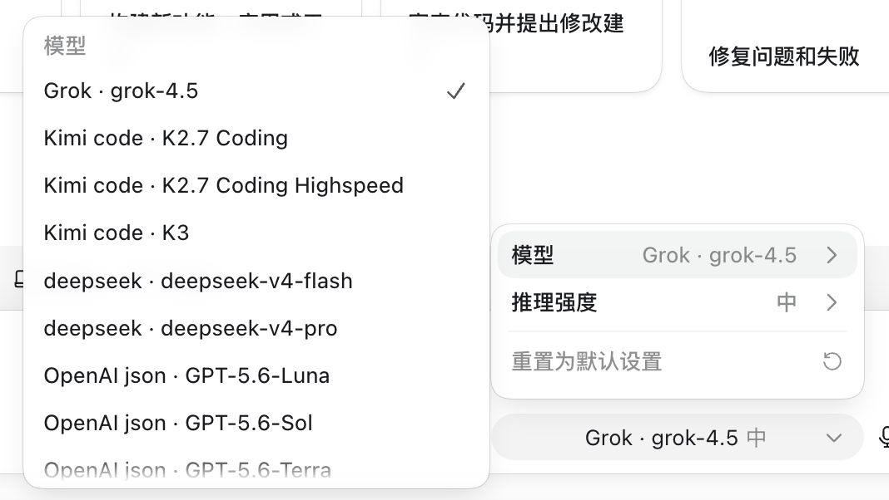

<p align="center">
  
</p>

<h1 align="center">Codex Spur</h1>

<p align="center">
  <a href="./README.md">English</a> · <b>中文</b>
</p>

<h2 align="center">
  你配好的模型，全部进 Codex 选择器。<br>
  一键切换。
</h2>

<p align="center">
  <em style="font-size: 1.15em; line-height: 1.55;">
    在 Spur 里接好 Kimi、DeepSeek、xAI、OpenAI 多账号或任意兼容网关，启用后点一次 <strong>Review &amp; Apply</strong>——它们就会出现在 <strong>Codex / ChatGPT Desktop 原生模型菜单</strong>里。写代码时想换模型，就在官方选择器里点一下，不用开新窗口、不用改配置、不用记一堆 API 入口。
  </em>
</p>

<p align="center">
  <a href="https://github.com/williamdh457/codex-spur/releases/latest">下载 DMG</a>
  ·
  <a href="#首次打开提示应用已损坏">「应用已损坏」处理</a>
  ·
  <a href="./CHANGELOG.md">更新日志</a>
  ·
  <a href="./LICENSE">MIT 许可</a>
</p>

---

> [!IMPORTANT]
> ### 首次打开提示 **「应用已损坏，无法打开」**？
>
> **几乎不是安装包坏了。** 公开 Release 的 DMG 是 **ad-hoc 签名、未做 Apple 公证（notarize）**。浏览器下载会带上隔离属性（quarantine），Gatekeeper 会拦截，并常误报成「已损坏」。
>
> **最快处理**（先把 App 拖进「应用程序」）：
>
> ```bash
> xattr -cr "/Applications/Codex Spur.app"
> open "/Applications/Codex Spur.app"
> ```
>
> 或：对 App **右键 → 打开 → 打开** · 或 **系统设置 → 隐私与安全性 → 仍要打开**。
>
> 完整步骤与「要不要买开发者账号」见：[§ 首次打开提示「应用已损坏」](#首次打开提示应用已损坏)

---

## 关于（About）

### 已配置的模型，都在 Codex 选择器里一键切换

这就是产品本身。

<p align="center">
  
</p>

<p align="center"><sub>你在 Spur 里配置的模型，出现在 Codex / ChatGPT Desktop 原生选择器中——点一下即可切换。</sub></p>

在 Spur 接好供应商、勾选要发布的路由、**Review & Apply**——模型进入 **Codex 原生选择器**。赶速度用 Kimi、控成本用 DeepSeek、硬仗用 OpenAI、私有端点走自定义网关：全部 **一键切换**，不用离开 Codex，也不用反复改配置。

Spur 是 **local-first** 的桌面控制面：管你真正在用的模型，不是把密钥交给云端，也不是去改写 `ChatGPT.app`。

**密钥只留在本机。** API Key、session / refresh token、代理 bearer 加密落盘，不进入 UI，不上传任何 Codex Spur 云服务，也没有凭据遥测。

**不注入客户端。** 仅通过受支持的 seam 接入：

1. 本机 OpenAI Responses 兼容代理  
2. 生成的 `model_catalog_json`  
3. 专用 provider：`codex_select`  

关闭主窗口时菜单栏代理继续运行；退出应用才停止代理并释放租约。v1 **不**安装 LaunchAgent 或特权 helper。

| | |
|---|---|
| 平台 | macOS（Apple Silicon 优先） |
| 技术栈 | Tauri 2 · React · TypeScript · Rust |
| 版本 | **0.1.1** |
| 许可 | MIT |

---

## 功能一览

### 供应商实例

- 同一类型可添加多个实例  
- **添加 → 保存并拉取 → 概览出现新行**  
- OpenAI：官方浏览器 OAuth（PKCE）、API Key、多账号 JSON、配置 JSON  
- Kimi Code 默认 `https://api.kimi.com/coding/v1`  
- 拉取结果为候选；模型页启用后才进入 catalog  

### 路由与调度

多账号 OpenAI 支持 `Pool` / `Fixed`。Pool 顺序：`previous_response_id` 亲和 → session-hash 亲和 → Top-K 加权。不健康账号会 escape。

### Reasoning 八档

```text
none · minimal · low · medium · high · xhigh · max · ultra
```

上游无法区分的档位会如实标注。

### 额度与重置卡

按 `limit_window_seconds` 展示最近 5 小时 / 7 天窗口。消耗重置卡需确认 + 幂等键 + 审计。

### 安全

密钥仅本地；SQLite 存 AES-256-GCM 密文；主密钥为应用数据目录下 `master_key.hex`（`0600`）。

```text
~/Library/Application Support/com.codexspur.desktop/
```

---

## 安装

### 要求

- macOS Apple Silicon（本 release 提供 `aarch64` DMG）  
- 已安装 ChatGPT Desktop / Codex  
- 可访问所配置的上游 API  

### 从 Release 安装

1. 打开 [Releases](https://github.com/williamdh457/codex-spur/releases/latest) 下载 DMG（例如 `Codex.Spur_0.1.1_aarch64.dmg`）  
2. 打开 DMG，把 **Codex Spur** 拖进 **「应用程序」**  
3. 打开 App（若被拦截，见下方 [「应用已损坏」](#首次打开提示应用已损坏)）  
4. 使用第三方模型时保持菜单栏进程在线  

### 首次打开提示「应用已损坏」

系统可能显示：

- *“Codex Spur”已损坏，无法打开。你应该将它移到废纸篓。*
- *无法验证开发者* / *Apple 无法检查是否包含恶意软件*

**原因：** GitHub 上的 DMG 目前是 **ad-hoc 签名、未公证**。从浏览器下载会带上 `com.apple.quarantine`，Gatekeeper 拦截后常误写成「已损坏」。  
**不是** 文件损坏，**也不是** 你本机 Apple ID「坏了」。

#### 推荐绕过方式（按顺序试）

| # | 方法 | 操作 |
|---|------|------|
| 1 | **清除隔离属性**（最稳） | App 已在「应用程序」后，在终端执行下方命令 |
| 2 | **右键打开** | Finder 中对 **Codex Spur** **右键 → 打开 → 打开**（首次不要双击） |
| 3 | **隐私与安全性** | **系统设置 → 隐私与安全性** → 找到拦截提示 → **仍要打开** |
| 4 | **从源码本地打包** | 本机 `npm run bundle:dmg` 一般没有浏览器下载的 quarantine |

**方法 1 — 终端（复制粘贴）：**

```bash
# 先把 Codex Spur 拖进「应用程序」，再执行：
xattr -cr "/Applications/Codex Spur.app"
open "/Applications/Codex Spur.app"
```

只删 quarantine 标记也可以：

```bash
xattr -d com.apple.quarantine "/Applications/Codex Spur.app" 2>/dev/null
open "/Applications/Codex Spur.app"
```

若 App 还在「下载」或桌面，把路径改成实际位置即可。

#### 不建议 / 无效的做法

| 做法 | 说明 |
|------|------|
| 反复重新下载 DMG | 每次浏览器下载都会重新打 quarantine |
| 指望免费 Apple ID 对外签名 | 做不到公开分发用的 **Developer ID + 公证** |
| `sudo spctl --master-disable` | 全局关闭 Gatekeeper，**不要**为 Spur 这么干 |
| 伪造公证 / 盗用证书 | 违法，且证书会被吊销 |

#### 想彻底「双击就能开」（维护者 / 付费方案）

让陌生人下载后无需 `xattr`，需要：

1. 加入 [Apple Developer Program](https://developer.apple.com/programs/)（约 $99/年）  
2. 创建 **Developer ID Application** 证书并装入钥匙串  
3. 用 Tauri **签名 + notarize + staple** 后再上传 Release  
   （文档：[Tauri macOS code signing](https://v2.tauri.app/distribute/sign/macos/)）

| 目标 | 免费 / 未公证 Release | Developer ID + 已公证 |
|------|----------------------|------------------------|
| 本机自己编译运行 | 通常没问题 | 没问题 |
| GitHub 下载后双击即开 | 需要 `xattr` / 右键打开 | 可以 |
| 对所有用户静默通过 Gatekeeper | **没有可靠免费路径** | 可以 |

### 卸载

1. 从菜单栏 **退出** Codex Spur（不要只关窗口）  
2. 删除 `/Applications/Codex Spur.app`  
3. （可选）删除 Application Support 下的本地数据  
4. 按需用 App 内备份恢复，或检查 `~/.codex/config.toml` 与 `~/.codex/codex-select/`

---

## 快速开始

1. 添加供应商并拉取模型  
2. 在模型页启用路由  
3. Review & Apply 写入 `codex_select` 与 catalog  
4. 在 Codex 模型选择器中一键切换  
5. 保持 Spur 代理运行  

### Desktop 可见性

| 登录 | 位置 | 用途 |
|------|------|------|
| Desktop 官方登录 | `~/.codex/auth.json` | GUI 是否显示第三方模型 |
| Spur 凭据 | 本地 vault | 仅代理上游鉴权 |

---

## 从源码构建

```bash
npm install
npm run dev:app
npm run typecheck && npm run lint && npm run test
npm run bundle:dmg
```

详情见英文 [README](./README.md)。

---

## 架构与文档

- [`AGENTS.md`](./AGENTS.md) · [`DESIGN.md`](./DESIGN.md) · [`IMPLEMENTATION.md`](./IMPLEMENTATION.md)  
- [`THIRD_PARTY_NOTICES.md`](./THIRD_PARTY_NOTICES.md) · [`CHANGELOG.md`](./CHANGELOG.md) · [`LICENSE`](./LICENSE)  

---

## 免责声明

本工具为本地集成助手。请遵守上游服务条款；配额、账号与备份责任由使用者自负。
